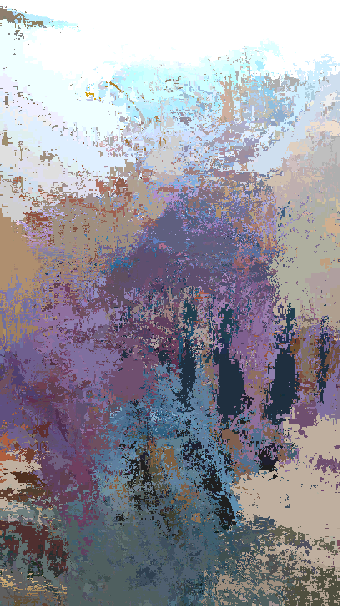

# Study in Angle

This repo contains the processing code for an art project I am calling Study in Angles. This is a [pixicog](https://github.com/mcwhittemore/pixicog-go).

The goal is to make artistic images that capture the feeling of short videos by slicing frames together in response to the videos content.

